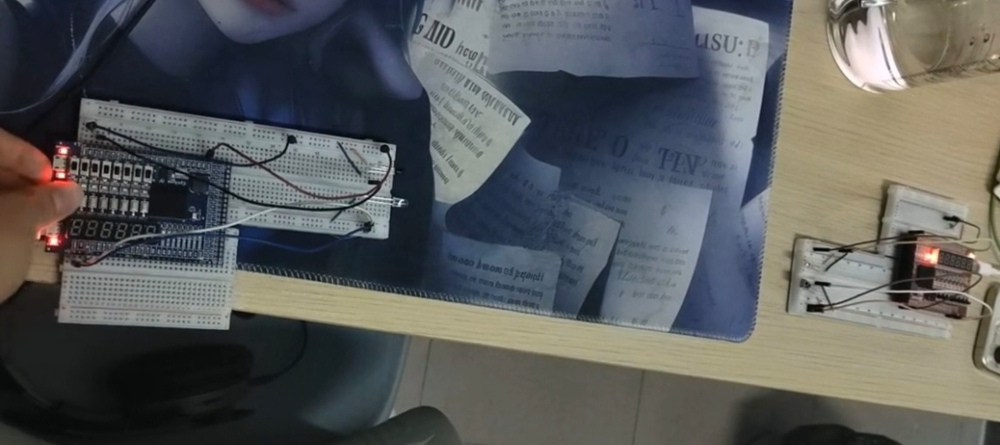
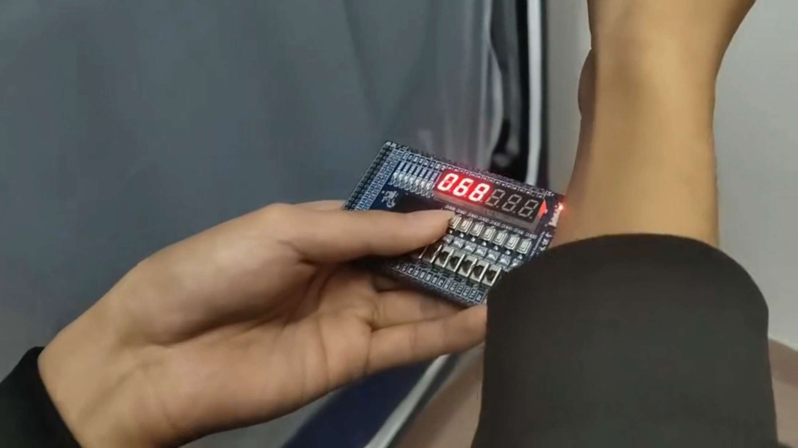

# FPGA 学习项目集合

本仓库收录了我在大学时期基于 Altera Cyclone IV E (EP4CE6F17C8) 完成的部分优秀 FPGA 作品，采用 VHDL 实现。这些项目承载着那段专注投入的宝贵时光，以此记录并怀念曾经的美好。

## 项目列表

| 项目 | 说明 | 详细文档 |
|------|------|----------|
| [hongwai_src](./hongwai_src) | 红外收发器（IR Transceiver） | [查看 README →](./hongwai_src/README.md) |
| [measure_distance_src](./measure_distance_src) | 超声波测距模块（Ultrasonic Distance Measurement） | [查看 README →](./measure_distance_src/README.md) |

## 项目预览

### 红外收发器（IR Transceiver）



基于 38kHz 载波调制的红外数据收发系统，支持 8 位数据的无线传输。包含发送模块（ir_tx）和接收模块（ir_rx），通过按键触发发送，数码管显示接收数据。

[→ 查看项目详情](./hongwai_src/README.md)

### 超声波测距模块（Ultrasonic Distance Measurement）



配合 HC-SR04 超声波传感器实现距离测量，通过 3 位共阴数码管实时显示测量结果（单位：cm）。每 0.01 秒自动触发一次测量，最大显示距离 999cm。

[→ 查看项目详情](./measure_distance_src/README.md)

## 开发环境

- **FPGA 芯片**：Altera Cyclone IV E (EP4CE6F17C8)
- **开发工具**：Quartus Prime 18.1.0 Lite
- **描述语言**：VHDL
- **时钟频率**：50 MHz

## 仓库结构

```
FPGA_Practice_Collection/
├── hongwai_src/              # 红外收发项目
│   ├── ir_tx.vhd             # 红外发送模块
│   ├── ir_rx.vhd             # 红外接收模块
│   ├── top.bdf               # 顶层原理图
│   └── ...
├── measure_distance_src/    # 超声波测距项目
│   ├── measure_distance.vhd  # 核心测距模块
│   └── ...
└── README.md                 # 本文件
```

## 快速开始

1. 使用 Quartus Prime 18.1.0 Lite 打开对应项目的 `.qpf` 工程文件
2. 进行引脚分配（已包含在 `.qsf` 文件中）
3. 编译并下载到 FPGA 开发板

## 致谢

感谢邓老师的教学与指导。

## 声明

本项目仅供学习交流使用。
